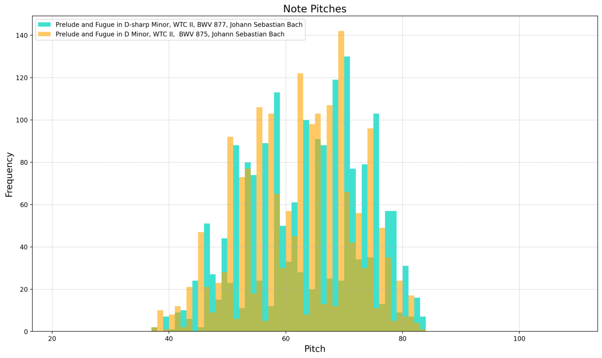

# midi-pydata-london-24
Presentation, code snippets and scripts for Can machines play the piano? presentation at PyData London 2024

## Presentation

To start presentation run:

```shell
streamlit run --server.port 4001 presentation.py
```

## MIDI data

### MIDI to dataframe

To load a midi file into a dataframe, we use:

```py
import fortepyan as ff

piece = ff.MidiPiece.from_file(path="data/piano.mid")
```

```shell
python midi_basics/midi_to_dataframe.py
```
### Maestro dataset

You can find maestro dataset with "notes" and "source" column at huggingface

```py
from datasets import load_dataset

dataset = load_dataset("roszcz/maestro-sustain-v2")
```

|    | Split      | Records | Duration (hours) | Number of notes (millions) |
|----|------------|---------|------------------|----------------------------|
| 0  | Train      | 962     | 159.4174         | 5.6593                     |
| 1  | Validation | 137     | 19.4627          | 0.6394                     |
| 2  | Test       | 177     | 20.0267          | 0.7414                     |
| 3  | Total      | 1,276   | 198.9068         | 7.0402                     |


### Average notes per second

We can calculate average notes per second in maestro dataset by counting rows in dataframes created from
dataset and dividing them by total time.

```py
for record in dataset:
    total_notes += len(record["notes"]["pitch"])
    total_time += max(record["notes"]["start"]) - min(record["notes"]["start"])
```

By using "start" time we are calculating how many notes were pressed in a second on average.

```shell
python midi_basics/notes_per_second.py
```

### streamlit-pianoroll

To visualize and listen to a midi file, we can use streamlit-pianoroll component.

```py
import fortepyan as ff
import streamlit_pianoroll
from datasets import load_dataset

dataset = load_dataset("roszcz/maestro-sustain-v2", split="test")
record = dataset[77]

piece = ff.MidiPiece.from_huggingface(record=record)
streamlit_pianoroll.from_fortepyan(piece=piece)
```

```shell
streamlit run midi_basics.streamlit_piece.py
```

## Comparing MIDI Pieces

### Plotting Note Pitches Comparison

We can compare the distribution of note pitches between two MIDI pieces using matplotlib histograms.
This can provide insights into the pitch range and distribution within each piece.

```shell
python midi_basics/two_performances.py
```



### Duration Distribution Comparison

You can compare the distribution of note durations between MIDI pieces composed by different composers using histograms generated with matplotlib.
 This comparison helps in understanding the temporal characteristics of musical compositions and may reveal stylistic differences or compositional preferences.

```shell
python midi_basics/compare_composers.py
```


### Deployment

Run with docker:

```sh
docker build -t pydata-london-24 .
docker run -p 4334:4334 pydata-london-24
```

### Code Style

This repository uses pre-commit hooks with forced python formatting ([black](https://github.com/psf/black),
[flake8](https://flake8.pycqa.org/en/latest/), and [isort](https://pycqa.github.io/isort/)):

```sh
pip install pre-commit
pre-commit install
```

Whenever you execute `git commit` the files altered / added within the commit will be checked and corrected.
`black` and `isort` can modify files locally - if that happens you have to `git add` them again.
You might also be prompted to introduce some fixes manually.

To run the hooks against all files without running `git commit`:

```sh
pre-commit run --all-files
```
